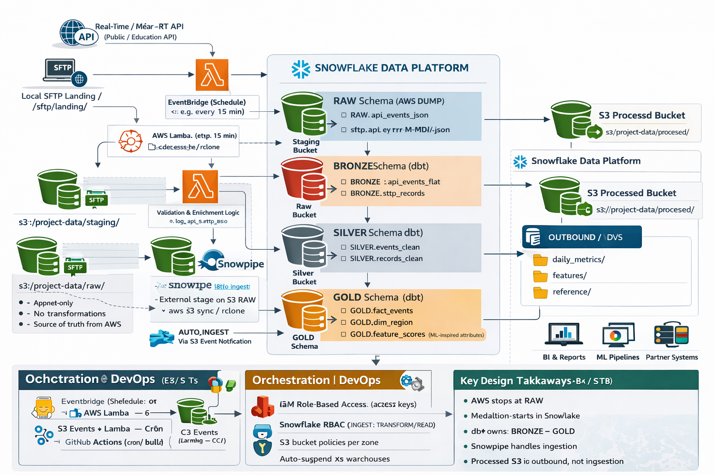

# pharma_event_driven_data_architecture
Event-driven pharma data platform using AWS, Snowflake, and dbt
## Architecture

## Project Vision
This project demonstrates an event-driven pharma analytics platform using AWS, Snowflake, and dbt. Synthetic commercial datasets (Rx events, HCP master, product master) are ingested through AWS S3 and Snowpipe into an immutable RAW layer in Snowflake, then transformed using a governed medallion architecture (BRONZE → SILVER → GOLD) for analytics-ready facts, dimensions, and feature tables.

## Tech Stack
- AWS: S3 (staging/raw/processed), Lambda (validation/enrichment), IAM (role-based access), EventBridge (optional scheduling)
- Snowflake: Snowpipe (auto-ingest), schemas (RAW/BRONZE/SILVER/GOLD)
- dbt: SQL transformations, testing, and layer promotion (BRONZE → GOLD)
- GitHub: version control and project documentation

## Data Sources
- Rx Events (synthetic, daily-style feed)
- HCP Master (synthetic reference data)
- Product Master (synthetic reference data)

## Use Cases (Scope-limited)
1. Product adoption tracking (uptake trends by region/HCP segments)
2. HCP prioritization features (adoption velocity, frequency, momentum-style features)

## Build Order
1. Land synthetic files into Snowflake RAW via AWS S3 + Snowpipe
2. Setup dbt project and define RAW sources
3. Build medallion models: RAW → BRONZE → SILVER → GOLD (start with Rx events)
